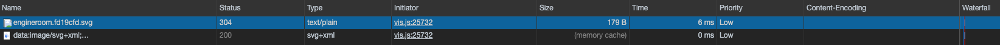
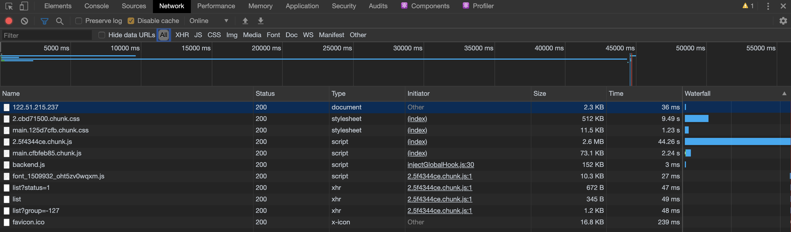
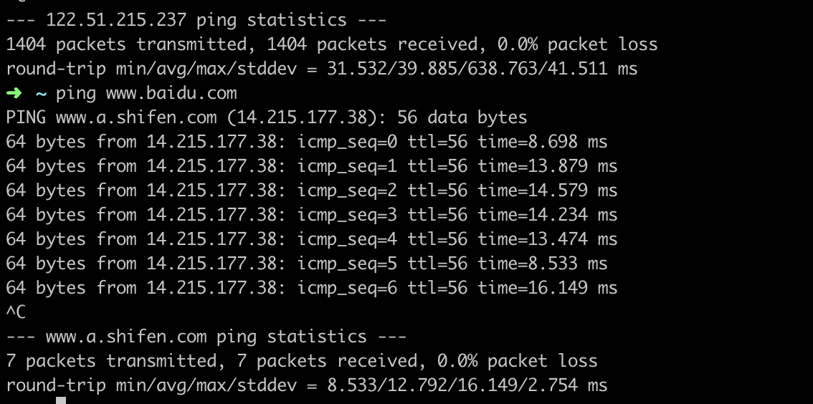
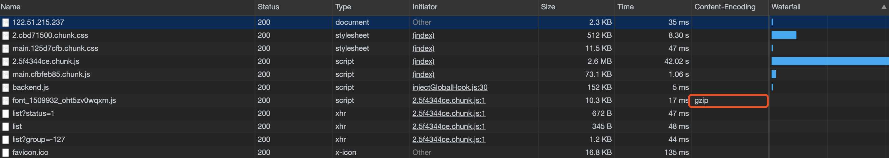
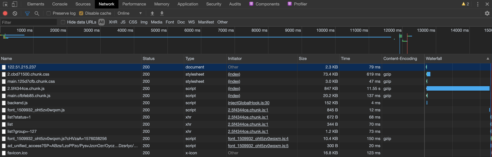
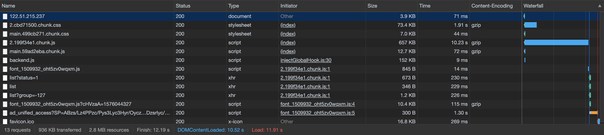
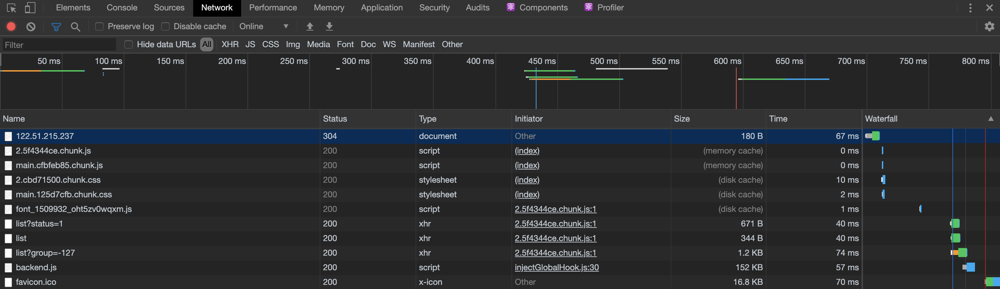
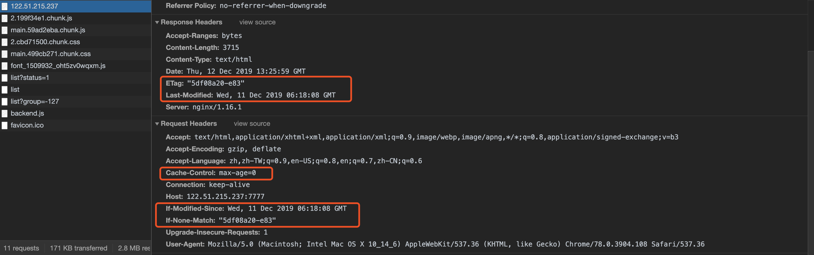

## 总结

针对前端性能优化，基于输入url到页面渲染，最后到页面再次打开的过程进行思考，采用渐进式的思路进行优化

基础优化：包括网络情况，硬件设备；文件压缩减少传输时间；针对图片文件，很入不同格式图片的编解码过程来选择不同的图片格式

进阶优化：异步加载文件，减少第一次传输文件大小；浏览器渲染，缩短最短渲染路径，减少重绘和回流；进行浏览器缓存，来优化再次打开页面的时间

服务器方面：通过 SSR(服务器虚渲染) 来执行优化

优化的思路：资源大小，http请求数量，渲染最短路径，代码和框架层面（大数据量列表渲染，尾递归来遍历树节点）　

针对这三个方向的优化：实际上现在的框架已经帮助我们做了不少工作，以 react 项目为例，通过create-my-app创建的项目已经：

- css,js合并
- 实现虚拟dom本身就减少了重绘和回流操作，虚拟dom的实现，其优化原理就是将针对元素的多个操作，合并为一个操作，以最小的代价去更新DOM

bigpipe dom元素占位（通常为一个带id的空div标签），通过异步请求去获取占位元素的内容（html,css）其劣势表现在：

- 需要后端支持
- seo
- 异步请求较多


## 复盘

针对首屏渲染优化，我达到了由之前等待40s以上到现在（2019-12-11）10s左右的优化效果，思路就是重要的东西同步加载，不重要的东西异步加载（通过接口去请求，src属性），做了这些尝试：

- 做了一些准备工作，了解 Network 面板的深入使用，ping 来查看网速和其基本知识，找到影响性能的文件对其进行重点优化
- 通过服务端koa2和nginx开启gzip，对已经合并压缩过的 js,css 进行进一步压缩，优化效果显著
- 通过 import() 的异步实现，来动态加载路有组件，使首屏的js,css文件仅仅针对首屏，其他模块再去进行记载，优化效果不错，并且随着模块增多，其效果更佳

针对性能优化这一块的了解，之前仅仅停留在通过浏览器输入url到渲染出网页这个过程中去进行一些经典的优化措施，比如调整 src 标签的位置、模块按需加载、文件合并压缩、减少重绘和回流、优化代码等，但是其实这些大部分的框架cli已经帮助我们实现了，甚至有些规则已经不再适用

为什么说之前的规则（例如Yahoo军规）不再适用呢？

例如主要针对资源加载顺序，yahoo建议将文字资源放在最前，但是随着网站类型的多样化，视频网站可能需要开始就播放一个视频，这时需要flash和视频资源在前面，或者图片网站需要将图片放在前面，此时yahoo军规就不再适用

因此，技术目光需要更新，这也是一次有趣且有效的尝试，并且这种探索需要继续执行下去，针对不同的框架，优化的策略也会有所不同


## 性能优化的术语

首屏时间，加载到第一屏能够看到，并且核心功能可用的时间

白屏时间，输入 url 到能够看到页面第一个内容的时间

可操时间，针对模块，主要是测试核心模块的使用率和用户感知


## 针对图片的优化

通过 css, svg 

css效果和css动画，在任何分辨率和缩放级别都能够良好展示，比如 material font 可以通过自定义字体的方式对其进行使用，从而避免了一些图片类型的图标

svg 比如 iconfont 可以直接生产一个 svg 图标库的js代码，里面讲各个图标通过 svg 进行实现

图片分类
- jpg, 全称为 jpeg，以24位颜色存储单个位图，体积较小
- png，以256位颜色存储当个位图，通常体积较大，支持透明度
- gif，以256位颜色存储当个位图，通常用作动画
- svg，可缩放矢量图形，通常用来画地图类

图片加载效果，一种加载表现形式是先模糊，随后清晰（小波算法），另一种是逐行进行加载（离散余铉变化算法），产生区别的原因在于其压缩算法不一致，浏览器根据不同的图片选择不同的算法，更改文件后缀名不会变更算法，因为压缩算法读取的是文件头部

优化措施：
- CSS Sprites，雪碧图，减少图片资源的请求
- 利用新元素 `<picture>` 来动态适应屏幕

### SVG

背景：topology chart 的一次开发中，需要用到不同的 `.svg` 图片来今天不同类型的展示，发现某些资源可以几乎无延迟加载，而另一些资源会有明显等待时间...

基于这个现象，进行了一些深入的研究

打开 console 会发现，同样是是 `.svg` 文件，对比 Time 可以发现，资源1是 `from gzip/http request`（4ms），资源2是 `from memory cache`（0ms）



- 文件大小不同，资源1 size 明显大于资源2，通过比较源文件得出
- 两者都是 GET 方法，资源1 `Request URL` 为 `xxx.svg`，资源2为 BASE64 编码
- 资源1命中协商缓存，需要从服务器拉取资源；资源2名中强缓存

尝试将资源1进行预加载，提升其在浏览器解析时的 priority，结果仍无变化，说明确实是每次加载都会向服务器进行请求

**都是 svg 文件，为何请求方式产生差别呢？**

一个可能的推测就是，由于 svg 文件较大，超过了浏览器对 `GET` 方法 request url 的长度限制，导致不能使用 BASE64 编码来进行请求，从而向服务器发出 `.svg` 文件的请求

比较两者的请求可以发现，资源2是前缀为 `data:` 协议的 URL，其允许内容创建者向文档中嵌入小文件，其本质是嵌在 HTML 和 CSS 文件中的以 BASE64 编码的二进制数据形式的文本，其控制还是依赖于 `Request cache headers`


## 2019-12-11

GROWTH项目已经基本部署在腾讯云上了。在收获了一点点的成就感的同时，发现一个很严重的问题：第一次加载摆平时间特别长，一瞬间脑子里面各种经典的性能优化的理论冒了出来，结果发现可行性（或者说体能提升效果）并不值得期待，因为 react 已经是执行了压缩合并之后的代码了，那么问题来了：

**react 内如何进行首屏性能优化呢？**

首先，打开 console，勾选 `network - disable cache`，然后重新加载页面，资源加载时间如下：



可以看到，有个2M多的chunk.js加载了40s以上，所以，它是怎么发生的呢？

### setp1:网速

第一个想法：查看服务器网速，看是否因为网速限制，导致资源下载过慢，通过 `ping` 来实现，ping 了服务器地址和百度的地址进行比较发现



确实服务器网速比较慢，慢了三倍以上，同时根据 TTL 可以看出其经过的路有器节点要比百度多4个

这里学习了下 ping 命令：

`64 bytes from 14.215.177.38: icmp_seq=6 ttl=56 time=16.149 ms` 代表从 14.215.177.38 进行一次 64 字节的数据传输耗时 16.149ms（即延迟）

ttl 表示数据包的生存时间，展示的是剩余的生存时间，它用来计算数据包在路由器上的消耗时间，因为现在绝大多数路由器的消耗时间都小于1s，因此将其算作1s，所以数据包每经过一个路由器节点TTL都减一。默认情况下 linux 的 ttl 原始值为 64

ok，网速的问题暂时没法解决，即使网速/3，还是会加载10s以上，因此，继续探索

### step2:gzip

gzip 是一个常用的优化方式，通过对资源文件进行进一步压缩，来减少资源文件的传输时间

首先，查看资源的 Request Headers，观察其 `Accept-Encoding: gzip, deflate` 说明浏览器支持 gzip，可以通过配置 Network 的面板来直观看出哪些资源是使用gzip进行压缩后的文件，可以看出只有通过 iconfont 生成在线字体的 js 文件使用了 gzip



那么，将其它资源文件也进行 gzip 压缩，再看看效果

react 内查看 `webpackDevServer.config.js` 配置，发现其已经开启了 gzip 压缩，即 `compress: true,`


对 nginx 进行配置，开启 gzip

```
gzip  on;
# 压缩阈值 小于 10k 不压缩
gzip_min_length 10k;
# 分配 4*16k 的内存用于缓存压缩结果
gzip_buffers 4 16k;
# 压缩级别，越小越快，但是效果越差
gzip_comp_level 3;
# 设置支持压缩的Content-Type
gzip_types text/plain application/x-javascript text/css application/xml text/javascript application/x-httpd-php image/jpeg image/gif image/png application/javascript;
```



可以看出经过 gzip 解压之后，再次重新请求，发现时间缩短了近4倍，对于小于10k的资源，都进行了gzip压缩操作，说明通过 gzip 进行优化是一个可行的方案，但是时间还是很长，继续探索

### step3:react-router 异步加载

create-react-app 会将所有用到的模块都打包进一个js文件内，但是实际上首屏不用加载所有的功能模块，此时一个优化思路就是将不需要在首屏上加载的模块通过分片chunk的方式，异步进行加载，当进入到那个页面时，才去加载该模块进行渲染

具体实现时通过 import 的异步加载方法结合 react-router 进行，参考通过import()实现异步加载



可以发现，`main.chunk.js` 文件减小了100k以上，加载速度提高了2s左右，并且这种优化，会随着模块的增多而更加明显


## 2019-12-12

当优化首屏渲染之后，再次打开网页，发现页面加载在秒级内就进行了响应，为何？

我开控制台发现了一些有趣的东西，之前加载过的资源，现在加载特别快，且其size也发生了相应的变化

- 有不同颜色的200，并且其资源的size为from memory 或者from disk
- 一部分资源为304状态码，即请求发送过去，服务器发现资源并没有发生变化，于是返回一个实体主体为空的响应报文



ok，借此机会来理一理浏览器缓存机制，首先基本概念，浏览器缓存包括：HTTP缓存，indexDB，cookie，localStorage，sessionStorage 等

这里，与图相关的是HTTP缓存，即通过HTTP首部行信息来管理缓存，结合下图来对HTTP缓存进行理解



HTTP缓存分为强缓存（cache-control）和协商缓存（e-tag, last_modified）的简单流程：

- 浏览器根据加载资源的http request 首部行信息，即cache-control（注意 expires 为http1.0的产物，这里不做讨论）字段来判断是否命中强缓存，如果命中则直接从缓存中加载资源，这个过程主要由浏览器进行参与
- 如果未命中强缓存，则会将资源请求发送至服务器，由服务器通过比对 `If-None-Match && ETag`, `If-Modified-Since && Last-Modified` 来判断本地缓存是否失效，如果可以使用则服务器会返回一个实体主体为空的响应报文，浏览器直接从缓存内加载资源
- 如果协商缓存也没有命中，则正常进行请求，服务器会返回资源信息和缓存标识，浏览器加载新资源并更新缓存

第一个问题，**如何判断是否命中强缓存？**

通过 HHTP1.1 的Cache-Control规则来进行判定，它含有多个指令，且其优先级高于expires，对其进行一定了解

- `max-age=300` 表示300s 进行重新请求资源，会命中强缓存
- `no-store` 不缓存任何资源
- `no-cache` 客户端仍然缓存资源，是否使用缓存则需要根据协商缓存的验证规则来决定
- `public` 表示浏览器和代理服务器都进行缓存
- `private` 表示仅浏览器对资源进行缓存

强缓存不会发http请求，比如上图中 status=200 且至灰的请求，可以看出从 memory cache 时延为0ms，从 disk cache 时延差不多为2ms

第二个问题，**如何判断是否命中协商缓存？**

协商缓存需要进行 http 请求，主要由后端进行验证，参与的两个规则分别是 E-Tag 和 If-Modified-Since，如果返回304，则表示服务器没有更新，直接从缓存内读取资源，否则返回200，且从服务器加载资源
- 浏览器第一次请求一个资源的时候，服务器返回的 header 中会加上 Last-Modified，Last-Modified是一个时间标识该资源的最后修改时间，之后再次请求该资源时，浏览器会在请求内添加 If-Modified-Since字段，让服务器判断资源是否发生改变
- If-Modified-Since/Last-Modified 缺点在于其时间最小精度为秒，如果在很短时间内再次发生变化，则可能检测不到
- 因此，E-Tag 提供了一种精度更高的判定方法，即为每个资源添加一个唯一标识，每次资源改变都会重新生成该标识，通过判断 If-None-match/E-Tag 来判断是否命中协商缓存
- E-Tag 优先级高于 Last-Modified

第三个问题，**强缓存如何进行存储和读取**？

因为看到强缓存分为 disk cache 和 memory cache，且 disk cache 读取成本高于 memory cache，那么其区别在哪呢？

- 可以类比 sessionStorage 和 localStorage 来进行理解，disk cache会将缓存放在磁盘中，memory cache会放在内存中
- memory cache 更快，但是生命周期短，关闭页面就会释放，主要用来存放 js 文件，因为 js 文件经常要读取，css 文件可能只用读取一次
- disk cache 更慢，但是生命周期长，推测清除浏览器缓存时进行清理，通常在内存占用较高时存放文件，或者存放大文件和不常用的文件缓存
- memory cache 的读取优先级高于 disk cache


### React优化尝试

React的虚拟DOM实际上已经帮我们解决大部分的性能优化，但是这只是思维模型上带来的红利，那么其框架本身如何做优化呢？

- 一个方向是，减少 render() 方法的触发次数
- 合理拆分组件，尽量不要因为改动，影响整个应用或者其他不相干的组件

#### 2019-12-13

在 react 官网上有[性能优化](https://zh-hans.reactjs.org/docs/optimizing-performance.html)，阅读之后，发现在现有项目基础上有操作的空间

优化点：

- react 默认是不为每个组件添加 `shouldComponentUpdate` 的生命周期方法的，即每个组件都会按照 diff 算法的规则进行执行，但是你可以在组件内实现该方法，用来表示该组件在何种情况下才需要重新渲染，从而减少了dom渲染的次数，达到优化的目的
- 除了在每个组件内手动实现 `shouldComponentUpdate` 的方法外，React更推荐通过直接继承`React.PureComponent`的方式来进行浅比较，这种办法在大部分情况下适用，它是通过 `Object.is()` 的算法来进行比较，这种比较是一种浅比较，结合浅拷贝来理解，即现比较基本类型，再针对引用类型进行比较，优化比较其长度，之后通过循环进行比较
- 也就是说，当你的数据结构比较复杂时（即多层引用嵌套），要进行此类优化，最好是自己实现 `shouldComponentUpdate`，否则直接继承 `React.PureComponent` 即可
- 继承 `React.PureComponent` 时，可以通过浅拷贝的方式，来为 setState() 方法重新赋值，常用的拷贝方法：`Object.assing({})`, `array.concat()`, `[...array, 'newValue']`，这样做是防止指针没变，但是其实际内容发生改变，但是没有触发render()的情况
- 对于使用了 redux 的应用，在 reducer 内实现拷贝的过程

```js
// 对于此类引用类型，尽管其值改变，react 会认为其没变
let a = {a: 1};
let b = a;
b.a = 2;
Object.is(a, b); // true
```


#### 2019-12-25

之前的继承 `React.PureComponen` 是针对class组件的，那么对于函数组件应该怎么办呢？

React 提供了 `memo()` 高阶组件来解决这个问题，如果你的组件是一个“纯组件”，即函数在给定相同的props情况下能够渲染出相同的结果，此时可以通过memo来进行优化，它会跳过组件渲染并复用最近的一次渲染结果

默认情况下做浅层比较，但是可以通过传入一个函数进行深度比较

```js
function HeaderMemo(props) {
    return (
        <LocaleContext.Consumer>
            {/* value 在这里代表 this.context */}
            {({assets}) =>
                <Row className='module-header' type='flex' justify='space-between'>
                    <Col className='text-box'>
                        <IconFont
                            className='icon'
                            type={props.icon.type}
                            style={props.icon.style} />
                        <span className='title'>{props.title}</span>
                    </Col>
                </Row>
            }
        </LocaleContext.Consumer>
    );
}

export const Header = React.memo(HeaderMemo, (prevProps, nextProps) => {
    console.log(prevProps, nextProps);
    // 与 shouldComponentUpdate 相反，true 表示不需要更新
    return true;
});
```


