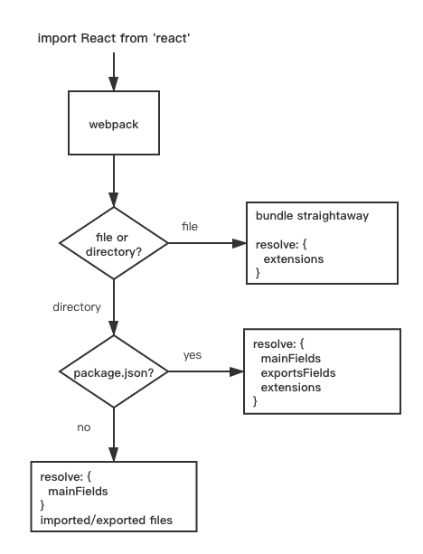

在讨论模块化的其他内容之前, 我们先来定义一下什么是模块:

​ **开发者将程序切割成的离散的功能块(discrete chunks of functionality)**

{/* truncate */}

对于现在的 Web 应用来说, 模块化是一个绕不开的话题:

​ **模块化是指将一个复杂的系统分解为多个模块以方便编码, 简单来说就是: 输入/输出代码块**

在 jQuery 的那个时代, 大多数的脚本都是将其 API 挂载到全局命名空间（比如 `window.$`）下, 以在不同文件内进行引用.

现在回过头来思考一下, 这样的做法会带来一些问题

- 无法合理地管理项目的依赖和版本（命名空间冲突的问题）
- 无法方便地控制依赖的加载顺序

当项目的依赖增多或者前端项目变大时, 这种方式越来越难以维护, 于是有了模块的一些解决方案

这里仅针对 JavaScript 内的模块化方案进行介绍, 还有关于样式的模块化方案, 比如 `less` 等, 这里就不再进赘述, 目的是为了让你能够感知到:

**我们封装了很多轮子, 来使我们更高效的编码, 但是往往需要编译后的代码才能来让轮子跑起来(机器执行)**

## CommonJS

随着 NodeJS 的流行, 这种模块化方案被发扬光大, 其核心思想是**通过 `require` 方法来同步加载(输入)依赖, 通过 `module.exports` 来输出代码块**

CommonJS 通常被用来在非浏览器端管理依赖，设计目的是避免模块定义全局对象.

**在 CommonJS 内，一个文件就是一个模块**

可以直接在 NodeJS 环境下运行, 但是无法直接在浏览器环境下运行, 需要转换成标准 ES5

## AMD

**AMD(Asynchronous Module Definition)** 顾名思义, 它采用异步的方式来加载依赖的模块, jQuery 时代里, [requirejs](https://requirejs.org/) 就是其典型代表.

看一个使用 `requirejs` 的例子：

```javascript
// defined a module
define('jquery', function (jq) {
  return jq.noConflict(true)
})

// require a moduel
require(['jquery'], function ($) {
  console.log($)
})
```

其优势在于

- 可以直接在浏览器环境或者 NodeJS 环境下运行
- 可以异步加载依赖
- 可以并行加载多个依赖

缺点也很明显, 就是需要引入第三方依赖来实现

## ES6 module

这应该是大家非常熟悉的, 现代框架都是支持的模块化方案, 但是它也无法在 NodeJS 和浏览器环境下直接运行

- 一个文件就是一个模块，不支持按需加载
- ES6 模块是静态的，即导入后无法进行更改
- ES6 是指针绑定，在编译时输出，不同于 CommonJS 值绑定，模块内做出了修改，会反映到所有使用该模块的代码中
- ES6 模块采用的是单例模式，每次对同一个模块的导入其实都指向同一个实例

## Webpack Modules Resolution

相比 Node.js, Webpack 能够支持更多的模块化方式

- ES6 `import` 语句
- CommonJS `require()` 语句
- AMD `require & define` 语句
- css/less/sass/scss 内的 `@import` 语句

**一个模块(业务模块/第三方库)能够被另一个模块引入和使用**, 针对引入模块的路径不同, 我们可以分为

1. 绝对路径: 根据路径去引入文件即可

2. 相对路径: 根据当前文件路径和相对路径去寻找其引入文件的绝对路径即可

3. 模块路径: 比如 `import 'antd'` 或者 `import {} from 'antd/lib/form' `, 在 webpack 内通过 `Resolve` 属性来进行解决

### Resolve

Webpack 通过 `entry` 来解决文件入口的问题, `resolve` 则是用类似**约定**的方式, 在模块内寻找模块所对应的文件

在开发过程中, 我们经常会用 `import React from 'React'`, `import renderCell from '@/components/cell-render'` 等各种类似“代理”的方式来引入模块, 此时 webpack 就是通过 **resolve** 配置项来寻找到相应的模块

通过一个简单的例子来看看常用的属性配置:

```javascript
  resolve: {
    // alias 通过别名来映射一个新的导入路径
    alias: {
      // 如果直接用 './src' 会产生错误
      '@': path.resolve(__dirname, 'src/')
    },
    // mainFields 用来指定适配环境的代码加载顺序
    mainFields: ["broswer", "main"],
    // extensions 用来补全后缀, 并指定补全后缀并匹配的优先级
    extensions: [".ts", ".js", ".json"]
  },
```

**mainFields**

​ 一些第三方库会根据环境提供多份代码, 比如 `rollup` 打包时可以同时输出 `commonjs` 和 `ES6` 的代码, webpack 会根据 mainFields 来决定代码的使用顺序, 它会按照数组的顺序去 **package.json** 内进行寻找, 匹配到立即返回

**extensions**

​ 一个很有意思的属性, Ryan 在 deno 发布会上公开 diss 了这个设计(即自动匹配 index, 自动补全 .js), extensions 用来配置补全的后缀和后缀的匹配顺序, 比如 `import App from './app'` , 在默认配置下, 就会优先去匹配 `app.js`, 如果没有匹配到就继续匹配 `app.json`

---

简单来说, webpack 会结合 `package.json` 和 `resolve` 配置来定位目标文件

**要明白, 最终的目的是找到正确的文件, 并以正确的方式对其进行解析和打包**



如果指定的路径是一个文件: webpack 会直接打包这个文件, 这个过程会结合 `resolve.extensions` 配置来判断哪些文件类型是被支持的

如果指定的路径是一个目录:

- 如果文件内包含 `package.json`, 则会根据 `resolve.mainFields` 和 `resolve.exportsFields` 配置内的字段顺序进行查找, 第一个匹配的作为文件路径
- 如果文件内不包含 `package.json`, 也会根据 `resolve.mainFields` 配置内的字段顺序进行查找, 去检查是否匹配的文件名在 `imported/required` 文件目录内
