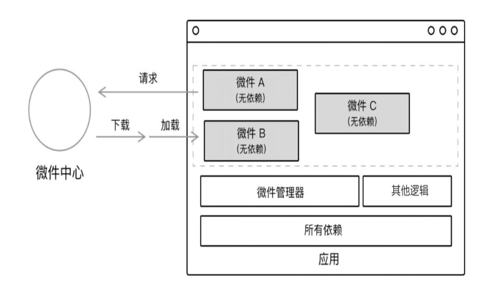
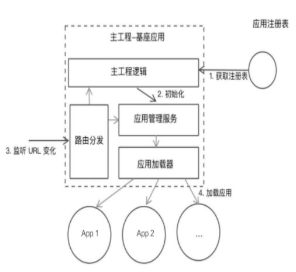

**Todos**

- MV\*
- Single-SPA
- Web Components


## Micro Frontend Structure

对微前端最直接的解释就是：将单一的前端应用转变为多个小型前端应用聚合的应用，各个应用独立开发和部署。
其特点包括：

1. 应用自治。遵循统一的规范，应用之间不存在依赖关系，插拔式
2. 单一职责。尽量每个应用有自己单独的域，因为一旦业务上有密切关联，通信是不可避免的
3. 技术栈无关。主要从基础设施和组件拆分粒度进行思考。
实际上，这一点不同于后端，如果应用流行框架的话，一般不会有大的改变。因为对于前端来，一个框架能够完成的事情，另一个框架往往也能够完成。
而后端则可以根据语言特性来作出最优的选择。

微前端适用于什么场景？

1. 旧系统迁移。已有系统能够稳定运行，人生苦短，尽量避免重写
2. 多个应用耦和。

目前来说，我理解的微前端架构重点在于，下面的微前端架构设计也是围绕这几个主题进行展开：
- 基础建设
- 应用拆解
- 应用通信
- 数据共享，不仅要考虑应用内的数据共享，还要考虑应用之间的数据共享。即域和更大的域
- 构建系统，既可以构建单独应用，又可以构建整个应用

### 技术实践

将微前端架构拆分来看，可以分为微应用和应用间通信，目前的一些技术实践方案：

1. 路由分发。利用 HTTP 反向代理，将路由映射到应用上
	- 利用 nginx 或者框架路由，建立路由到应用的映射
	- 同域下可以通过浏览器缓存进行通信
	- 存在问题：应用切换时，需要重新加载资源；需要刷新页面；一个页面只存在一个应用模块

```nginx
# 通过将不同应用代理到不同路径下实现路由分发
http {
  server {
    listen       80;
    server_name  aofe.phodal.com;
    location /api/ {
      proxy_pass http://127.0.0.1:8000/api;
    }
    location /web/admin {
      proxy_pass http://127.0.0.1/web/admin;
    }
    location /web/notifications {
      proxy_pass http://127.0.0.1/web/notifications;
    }
    location / {
      proxy_pass /;
    }
  }
}
```


2. 微应用化。个人感觉就是当前流行的开发模式，以业务拆分模块，同时维护公共组件库
	- 每个拆分的业务可以作为一个项目来维护
	- 构建时支持按需加载
	- 存在问题：通常只能使用一种前端框架，这时要注意框架的版本；


一般项目的目录结构：

- [D]scripts 用来存放打包配置及脚本
- [D]base app 主程序，用来分发路由，管理其他模块，基础建设
- [D]module A 各个模块下有自己域内的子路由
- [D]moduel B
- [F]package.json

这种模式的重点在于构建模式，能够**开发时**针对模块打包进行开发，同时在**构建时**能够打包各个模块，同时将各个模块打包后的文件，
移动到主工程内

可以结合 `import` 的特性和 webpack 对于 chunk 的支持来实现**路由懒加载**，当需要用到该子模块时，再对其进行加载，

这种模式的持续集成
- 子模块构建完成，触发子模块的持续集成，之后触发主程序的持续集成
- 主模块构建完成，触发持续集成，为了避免主模块的频繁变更引起冲突，可以设置定时更新和手动更新


3. 前端微服务化。一个页面可以存在多个独立开发、部署的前端应用
	- 拆解来看，就是创建 DOM，挂载应用，合适的时机卸载应用
	- 存在问题：卸载时事件监听；应用处理事件穿透；多组件引起的冲突；

相比微应用化，微前端服务化能够支持多语言框架，中心注册表进行管理。一般采用**基座设计模式**（详细内容见下）。

推荐当前社区一个流行的基座模式的框架 [single-spa](https://github.com/single-spa/single-spa)


4. 微件化。各个应用模块打包编译完成之后，放到指定的服务器上进行部署和统一管理，在应用运行时只需要加载相应的业务模块
	- 底层框架需要支持各个应用模块，即包含应用模块所需的所有依赖
	- 存在问题：性能，业务模块由提前编译变成运行时编译；需要开发一个构建系统用于管理独立的微件模块



5. iframe。关于 iframe，它是一个验证有效的方式，相当于一个“域”，各个应用独立运行
	- 存在问题：SEO 支持；需要设计相应的管理机制；


6. 结合 [Web Components](https://developer.mozilla.org/zh-CN/docs/Web/Web_Components) 构建，目前感觉这个是**版本答案**


### 微前端架构模式

大致分为两种：
- 基座模式。
即一个主应用对其他应用进行管理。
有点像 SPA，即一个应用承担基础核心的建设，它可以管理应用间的通信，管理应用的生命周期
- 自组织模式。
各个应用都是平等的，不存在管理关系

无论哪种方式都需要提高一个查找应用的方式，在微前端中称为**服务的注册表模式**，它需要提高以下功能：
- 应用发现，能够发现其他应用
- 应用注册，提供新的微前端应用，并且能够向应用注册表进行注册
- 第三方应用注册
- 访问权限控制

那么，如何设计一个微前端架构呢，我们需要关注，如果将一个单页面应用对比来观察，会发现很多设计上的相似点：
- 中心化：应用注册表（比如 SPA 的路由分发）
- 标识应用（比如 Vue 内的 `Vue.component()`，通过 name 来进行标识）
- 应用生命周期管理，提供一个生命周期的状态：
	- load: 判断加载哪个应用，进入生命周期
	- bootstrap: 记载静态资源
	- mount: 挂载应用
	- unload: 删除应用的生命周期
	- unmount: 卸载应用，取消订阅事件等
- 高内聚，低耦合


#### 基座控制系统

一个基座控制系统的设计图



1. 主工程运行，从服务器拉取最新的注册信息（即配置）
2. 获取配置后，创建各个应用，为每个应用绑定生命周期函数等
3. 主工程监测到路由变化，通过路由匹配分发到相应的应用
4. 加载相应的应用
5. 对于应用事件分发
	- 通过全局分发，各个应用内进行监听
	- 以应用名作为前缀，避免冲突


### 拆分方式

微前端框架的一个重点就是服务拆分，这里提供几个视角供参考：

1. 按照业务进行拆分。

2. 按照权限进行拆分。
这里的权限理解：比如一个网站同时有前台展示和后台管理模块，这时可以根据角色对系统进行拆分

3. 按照变更频率进行拆分。
根据一个模块的变更频率，重要程度来进行拆解。
将复杂，频繁变更的模块拆解出来，不仅能够聚焦，也能够减少其他模块的压力

4. 按照组织结构进行拆分。

5. 跟随后端微服务进行拆分。


### 微前端架构设计

1. 基础设施的构建。
不用多说，但是需要重点关注**CSS样式**引起的冲突，从组件，应用，系统三个层面去进行思考

2.应用通信机制。类似组件间通信，我们将应用的通信也可以大致分为：
同级通信（可以理解为挂载在同一个 Document Element 下的应用）和父子间通信（一般指通过 iframe 进行通信）

3. 数据共享。常见的几张数据共享方式：
- URI 参数控制
- 使用 localstorage 共享数据
- 其他客户端存储，如 IndexedDB, Web Sql等
- 服务端存储客户端状态


## What's Software Architecture?

> 架构是指体现在它的组件中的一个系统的基本组织、组织之间的关系、组织和环境的关系及指导其设计和发展的原则

以 lego 为例：
- 一个 lego 内包含实现最终完成体的所有物料
- 多个物料可以组合成一个模块
- 这个时候，说明书扮演着类似架构的角色，它说明了**物料**、**物料组织方式**、**预期效果**、**注意事项**
- 软件架构相对于说明书，它需要考虑当前环境的因素，需要一定的前瞻性，同时需要规定新模块的接入规范；同时它也有一定的局限性，它无法准确预计架构不再适用的标准和准确时间点

了解架构的基本原则之后，我们需要思考：架构从何而来？或者说，架构用来解决什么问题？

很重要的一点是，**脱离技术的角度去看待问题**，之前杨老师也经常跟我强调这点，随着开发经验的丰富，对这句话有了一定的理解

- 架构的落地是一个多方博弈的产物，因此，需要了解各方的利益和需求
- 寻找架构的特点（可以吹的点，业界有没有？为什么我的比他的好？）
- 关注点和优先级
- 跨功能需求
- 技术风险点

关注点和优先级，优先级往往不是绝对的，会根据具体项目来动态平衡

|key|value|
|:-|:-|
|性能|渲染，QPS|
|安全|数据安全，应对攻击的能力|
|平台化|承载其他系统的能力|
|代码维护|code review，快速上手，快速迭代|
|用户体验|简单，优雅|

**注意**: 作为一个程序员，要坚持以数据来说服人。比如提供不同浏览器、系统的占比，或者提供支持向下兼容的成本估算（真实的估算）

### Architecture Mode

架构风格是架构模式的表现形式，代码架构是架构风格的一个具体表现

- 分层风格，将系统按照水平切分的方式分成多个层，一个系统由多层组成，一层由多个模块组成，例如OSI七层模型和TCP/IP五层模型
- MVC，经典模型，由 View 和 Controller 共同完成用户界面的功能，设计一套变更机制，保证用户界面和模型的一致性
- 发布-订阅，基于事件，完成发布者和订阅者的交互
- 管理和过滤器，还比较陌生，这是一种适用于处理数据流的架构模式，它封装每个步骤到一个过滤器组件内，数据通过相邻过滤器之间的管道传输

一个架构，其产出或者说基本资源需要（部分内容对团队建设也有帮助）：

- 架构图
- 迭代计划
- 技术栈及选型
- 示例代码
- 测试策略
- 部署方式及持续集成策略
- 团队协作，GIT 提交策略

这里深入一点，架构设计最理想的是20%的计划式设计和80%的演化式设计，在计划式设计阶段，我们需要：

- 基础建设，确保架构能够处理的最大风险
- 前后端分离架构的基本规范，JSON 数据格式，RESTful API 规范；后台语言，数据库等；前端组织、UI框架等

### Frontend Architecture

前端架构的发展史，几个关键点

- 2005 年之前，主要还是后端渲染出 HTML（比如 JSP）,通过 JavaScript 做一些简单的动效
- 2005 年，**Google** 在其大多应用中使用异步通信技术，开启了 WEB 前端的新时代，这意味着，UI 和 Model 层的解耦，在这之后的很长一段时间内，JQuery 大发异彩，也启发了很多开发思想，比如动态渲染模版
- NodeJs 的出现再次为前端注入了新的活力，前端开始工程化，比如构建工具，包管理，模版管理等等，单页面应用的流行，诞生了两个优秀开源框架 React、Vue，同时也丰富了前端生态

随着前端项目的复杂，组件化和 MV\* 的方式已经渐渐发力，于是，微前端提供了一种解决问题新的思路，它被设计用来解决：

- 跨框架，在一个页面上，可以允许运行多个前端框架
- 应用拆分，将一个应用拆解为多个微小的应用，类似微服务
- 遗留系统迁移，兼容旧的前端框架

下面的主要内容，也是围绕这些问题来展开和思考🤔

就层级来说：
架构设计可以分为4⃣️个层级，每个层级有自己的关注点和规则，由上而下：

- 系统级，**前后端分离架构**、微前端架构，规定了应用在系统内的关系、前后端数据交换、系统集成等
- 应用级，规定应用外部的整体架构，组件共享，应用通信等
- 模块级，应用内部的模块架构，比如路由、状态管理等模块化
- 代码级，代码规范、原则、质量

**自上而下设计，自下而上完善**

前后端分离，不仅仅是指代码分离，它是一种技术决策，比如用户鉴权、API 接口管理和设计、API 文档管理、BBF、Mock Server


## What would you do

结合更实际的场景，如果由你来负责一个适合微前端的场景项目，你会怎么做？

不如先从宏观概念来解析这个问题

- 平衡业务进度和技术实现
	- 技术实现：方案设计、实施、上线、维护、开源或者沉淀
- 解决核心、复杂的问题
- 关注团队构建和成长

可以看出，技术架构其中在的一环，不起眼却很重要，可以看作一个项目的设计图（我理解为优秀项目的入口），
思考一下在工作中，当小组尝试重新构建一个项目时，我们是怎么做的？

一、技术准备期：技术强相关，耗时久

1. 前期进行大量有效调研和技术积累，明白系统的目的和需求，进行**架构设计**，这个过程通常输出一份架构图，用于展示和研究
2. 概念验证，这里已经涉及到项目分工和合作，这个阶段更多的是通过编写简单的代码来验证架构的可行性，进行快速迭代、调整或者淘汰
3. 迭代0，进入到这个阶段意味着：项目配套的技术准备工作已经就绪（我理解是可以直接开始编写业务代码），项目成员可以进行正常的开发工作，这个阶段，我们要做的：
	- 创建应用脚手架
	- 创建代码库
	- 搭建持续集成/交付
	- 权限控制
	- 内部培训

二、业务追捕期：这里探讨一下业务和技术的关系

> 先进的技术和架构是否一定会带来业务价值？不一定！

技术和架构价值最直观的体现？**业务价值的提升**

业务价值最直观的体现？**赚钱**

业务和技术两者是相辅相成，互相成就：没有业务做佐证的价值一文不值，没有优秀技术和架构支撑，业务也很难有好的表现

会看到身边毕业一两年的同事，执着于技术，作为一个技术从业人员来说未可厚非，但是以此作为抨击的点，就大可不必了，信息差会造成格局和视野的区别，所以做好自己就行

这个时期我们要做的：
- 测试，根据实际情况进行编写用例，尽量减少新需求和旧bug，开发和测试之间的矛盾
- 上线前准备，第一次项目上线

在这个时期，我们极大可能会因为能力高低和专注领域的不同而产生差值，这就是提升团队能力的机会：
- 技术分享，纯技术类或者项目相关技术类，分享的主讲人会从中受益
- 工作坊，是一种以练习为主，理论为辅的掌握新技术的方式，类似 Bootcamp
- 面对团队新人，采用**领航员-驾驶员**的模式来进行结对编程
- 对内和对外输出

ok，经过前两个时期，我们的项目已经可以稳定线上运行了，但是可以预见的是，不可能在各国阶段都做到尽善尽美。
如果你是一个“匠人”的话，欢迎进入第三个阶段

三、成长优化期

在开发过程中，常常会因为 deadline 而忽视测试和代码质量，或多或少会采取一些妥协措施，这种称之为**技术债**

1. 代码质量，比如接口、函数的大量复用，新旧模式的耦合，不规范的代码提交
2. 测试覆盖率，基本上国内互联网都没有专业的测试
3. 依赖问题，通过是依赖组件的更新，判断时候在项目内应用该更新内容

个人认为，偿还技术债往往带来更深的思考和更高的收益。除此之外，在这个时期要做的就是想方设法进行自我提升，可以是自动化测试，提升开发体验，代码迭代或者架构优化等


## Work Flow

> 通过一系列的流控制来保持质量-速度-需求的平衡

### 规范代码

代码结构往往能够反映顶层应用的设计，因此一个规范易读的代码还是蛮重要的（作为一个技术从业者，不要相信什么垃圾代码可以提升你的不可替代性，bullshit🐶）

规范相关的积累参看[开发规范](http://122.51.215.237:7771/normalize/)

除此之外，可以通过 ESLint, CSSLint 来进一步提高代码的质量，这样做的目的是团队能够输出风格统一的代码以及方便 review，**一般来说，Lint 工具已经可以解决大部分的代码规范问题**

### 规范项目文档

文档对于一个项目而言，是重中之重的存在，其实观察 GitHub 的功能模块对项目的支持

先说说项目内最基本的文档 --- **README.md**，一份好的 README.md 应该具备以下特点（其实可以多看看 Github 上著名开源项目）

- 支持运行的环境
- 必要的依赖，以及搭建流程
- 项目的安装指南
- 线上的示例或者最后运行环境
- 相关的文档链接
- 相关人员及讨论组

系统的架构图，可以用来减少共同成本，同时管理架构的变更记录，也是蛮重要的

系统的文档库
- 可编辑，可协作，安全（不要使用明文传输的有道云笔记）
- 记录里程碑和架构决策（标题，日期，决策相关状态，产生影响）


### 代码质量

从流程化和工具两个方面来提升代码质量。
所谓流程化，一般指的是通过常规代码检视（Code Review） 和阻塞式代码审视（PR）

如果对于代码有洁癖，推荐两者结合起来使用，这里稍微解释一下：

所谓常规代码审视，通常指通过 code review，代码说明和注释等方式来保证质量，
而阻塞式代码审视，则会比较“硬核”一点，通过技术手段，让不符合规范的代码无法进行提交，团队合作时可以看看 GitFlow


## Build Flow

随着前端工程化的演变，现在前端项目构建也是一个基本技能，同时也是 Web 应用中必不可少的一部分。
它的核心用途是，帮助开发者从源代码开发到最后目标应用的投入生产力

在这之前，先了解下[前端模块化]

对于前端来说，构建系统常常包括：

- 管理依赖
- 优化开发环境
- 代码质量检查
- 编译和打包（编译器处理，依赖引入，输入文件分片等）
- 测试及部署

为了达到以上这些目的和内容，需要通过一系列的措施和工具来进行，这个过程也就是**构建流**，对于一般的项目我们可以通过 `npm script`, `gulp`, `webpack`结合起来使用。
这些工具通过丰富的插件组合使用，已经能够满足我们的开发需求，因此，不要有畏难情绪。

思考三个问题：
- 我们的目的是什么？
- 如何对任务进行拆解？
- 部署时，展示的形式是什么？对于这个问题，我的解读就是，不同系统根据不同的业务分别进行部署

当构建流完成之后，我们还有一个提高幸福感的工作要做，就是**持续交付**

持续交付，根据部署方式可以分为：
1. 持续部署，构建完自动部署，常用于测试环境
2. 自动化部署，需要认为介入，进行发布
3. 手动部署


## 单页面应用 VS 多页面应用

这里根据页面内容的获取方式来区分应用。
变更路由后，从服务器获取页面的应用叫做多页面应用。
由后端一次返回所有的静态资源，变更路由后，由前端控制资源加载和释放的应用叫做单页面应用

对于架构使用单页面应用还是多页面应用的讨论，见仁见智，但是从当前环境来看，单页面技术更加复杂，但是也更有应用前景

多页面应用需要避免**散弹式架构**

> 如果每遇到一个变化，都必须在众多不同的 class 内作出修改来适应之，你所面临的代码坏味道就是散弹式修改。
如果你需要修改的代码散布四处，你不但难以找到他们，也很容易忘记对某个重要地方的修改

回忆一下在网易的开发经历，作为一个多页面应用，在系统内嵌入了很多 react 的资源文件，导致每次开发小需求时，
不仅需要维护一份需要修改的模块列表，同时需要去在每一个项目内进行修改，过程繁琐且易错

单页面相比多页面应该，最大的进步就是思想上的提升，具体表现就是针对前端，从 MVC 架构变更为 MV* 架构，具体可以参看[谈谈 MV\*]


## 前端组件化

> 创建拥有各自状态的组件，再由这些组件构成更加复杂的 UI --React

我理解的组件化，就是拆分关注点，对每一个焦点单独进行处理，从而降低整个系统的复杂程度

在一个团队内，如果需要实现系统的组件化，通常需要：

统一组件的风格（style guide）和文档规范，最好以页面形式呈现组件。
市面上已经有比较成熟的组件库，比如 **ant-design**, **material UI** 等，因此即使是自己来维护一个组件库，也可以进行参考


组件化的优势：

1. 开发效率
2. 一致性
3. 可维护性


## 前后端分离

随着单页面应用的流行，前后端分离也成为了趋势，目前前后端分离存在的问题

- 信息不对等导致的 bug
- API 的维护和管理

因此，前后端分离的主要问题在于信息的对齐，通常来说，前后端交流的方式就是 API，因此一份**好的 API 设计规范**则显得尤为重要。
除此之外，API 接口也需要及时性，后端可以提供 mock data 来暂时满足前端开发需求，并保证接口尽可能产生小的变更


对于接口变更，深有体会。最近的一项工作就是适配元数据接口，接口还是干的同一件事情，但是从底层到输出，整个的实现方式都改变，导致接口字段产生较大变化。
在这种情况下，除了找到各个引用文件，逐一进行修改，貌似也没有更好的规避方案。
即使建立了 model 层，最后还是会去各个引用文件内进行修改，除非将更优的数据结构转换成原来的数据结构，但是这样不好！

前后端分离的一个关注点就是**安全**

- token 和 cookie 的管理。前端需要发送请求时带上相关参数，同时捕获401 时逻辑处理。而后端会进行更为复杂的管理机制
比如二次登录失败，超时等
- 表单校验。前端的表单校验更多的是引导用户正确填写，而后端则默认前端所有数据不可靠，对数据进行严格地验证
- 权限管理。前端需要根据权限来进行展示，而后端则需要在每次请求时进行判断，对于高危操作，尤为重要
