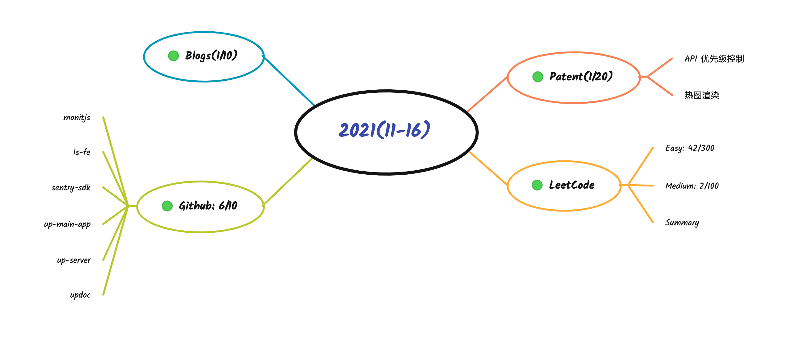

import { HighlightWithCode } from '../../src/components/Highlights'

从大二开始，编程也有了记笔记的习惯。

最开始记新学知识的流水账，每天都记且零零碎碎。

后面以项目为模块进行记录，什么都记。需求、背景、过程、问题、解决方案、自我复盘，踩过不少坑。

后来意识到这样不行，零碎无功。进而从语言、实践、工程多个角度去记，隔段时间进行总结、精炼，也会去综合沉淀，仍不牢固。

2021年下旬，有意识去研究知识管理，接触到 DIWK，颇有感触！

随着对知识的不同把握程度，博客工具也再不断进行更新（就是折腾...）

- 2016 被师傅 [octopress](http://octopress.org/) 领进门 
- 2017 被简单高效的 [hexo](https://hexo.io/) 吸引 
- 2019 紧跟时代的弄潮儿 [vuepress](https://vuepress.vuejs.org/zh/)
- today... [docusaurus](https://docusaurus.io/)

时代在变、公司在变、项目在变、工具在变、内容在变、计划在变...

**初心不要变。**

一直以 <HighlightWithCode bgcolor="#fc988c">solo with code</HighlightWithCode> 作为 slogan，现在我觉得 <HighlightWithCode bgcolor="#7385e4">nice to code</HighlightWithCode> 更加适合～

**好好保护那个以编程为乐的“小男孩”！**

