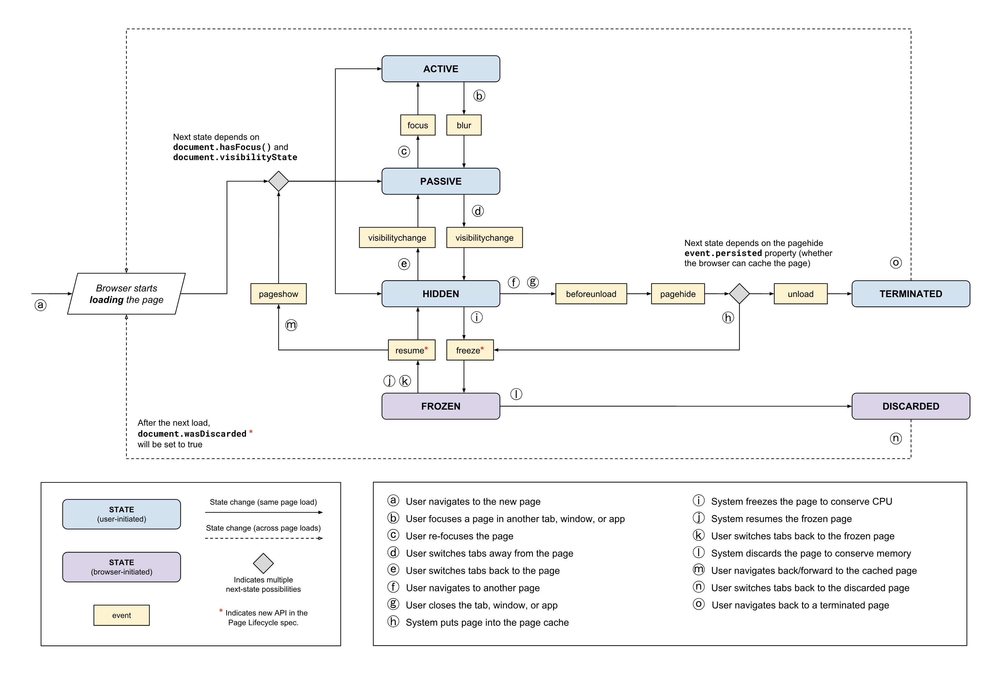

当深入观察浏览器的表现时，我们经常会遇到这样一些问题：

1. 当打开/切换一个 Tab 时，页面往往会有不同的表现：有时可以直接交互，有时需要重新加载页面后才能交互，有时页面直接卡死？
2. 当需要上报 web 应用的分析数据时，不同的性能指标应该在什么时机进行捕获和上报？
3. ...

实际上，通过对浏览器页面生命周期状态管理机制的研究，能够帮助我们更好的理解上述问题！

## Background

> **系统管理的核心在于资源**

应用生命周期管理是系统用来管理资源的关键方式。在 Andriod, IOS, Windows 系统内，可以随时开启/停止应用，通过重新分配资源，追求极致的用户体验。

以前在浏览器端，web app 可以一直保存运行状态，直到占用资源超负荷时，被动地被丢弃或者暂停应用。同时，我们也习惯针对用户引起的生命周期状态的改变进行响应，比如当我们打开/切换/关闭一个 web app 时，会去捕获 `onload`, `beforeUnload`, `unload` 事件。但是，**现在浏览器能够主动地冻结或者释放资源，从而降低资源的消耗（比如内存，CPU，电量），提升用户体验**。

那么问题来了 --- 我们如何察觉浏览器主动对资源执行的动作以及我们如何捕获由系统引起的生命周期状态的改变？

**The answer is Page Lifecycle API** -- Page Lifecycle 通过提供一系列的生命周期钩子来帮助我们更加安全地介入浏览器的不同状态并执行相应的措施，它主要解决了三件事：

1. 引入标准化的页面生命周期状态和概念；
2. 定义新的、由系统发起的变更状态，允许浏览器在 Tab 隐藏或者不活跃时限制其占用的系统资源；
3. 创建新的 API 和 Event 来让开发者捕获和响应由系统引起的状态变化；


## Page Lifecycle States

> **重要：页面生命周期所有状态都是离散和相互独立的，这意味着页面在某个时刻只能存在一种状态**



上图涵盖了页面所有可能的状态及其触发事件，接下来会对其关键点进行分析：

### browser-initiated

两个由系统引起的状态变化：FROZEN 和 DISCARDED

**FROZEN**

在冻结状态下，浏览器会停止执行事件队列内的可冻结任务（比如 JavaScript 内的定时器任务，请求任务等），直到页面解冻为止。已经执行的任务可以继续执行，但是会限制其对资源的使用（作用范围和执行时间）。同时，浏览器会保持一定的页面 CPU/内存的资源使用，从而更快地响应浏览器前进/后退事件（Back-Froward Cache 机制），而不需要重新加载整个页面。

**DISCARDED**

当页面被浏览器完全卸载时，页面处于废弃状态，此状态下页面不会执行任何事件

仔细分析我们可以看出，当页面从 `HIDDEN` 状态转变为 `FROZEN` 状态时，会优先释放 CPU 资源，再从 `FROZEN` 状态转变为 `DISCARDED`状态时，会释放内存资源。

---

### DISCARDED vs TERMINATED

**DISCARDED**

- 当页面被浏览器完全卸载时，页面将处于废弃状态，由浏览器引起状态变化
- 通过 `document.wasDiscarded` 来判断当前 page 之前是否被丢弃
- 前一个状态是 FROZEN

**TERMINATED**

- 当页面被浏览器卸载并**将其从内存中进行清理**时，页面将处于终止状态
- 在该状态下，新的任务不会被执行，已执行的任务会被限制资源而强制终止
- 前一个状态是 HIDDEN

---

### Hidden 状态改变

**HIDDEN -> FROZEN 存在两种途径**

1. 由系统控制，系统主动冻结页面来降低 CPU 消耗，通过监听 `freeze` 捕获其状态变化
2. 由用户行为触发，用户在当前 tab 切换到其他页面（多页面应用）或者用户关闭当前 tab, window 或者 app。在这个过程中会经历 `beforeunload`, `pagehide` 事件，如果  `pagehide` 事件内的  `event.persisted === true`（即浏览器判断能够缓存页面资源），则进入冻结状态

**HIDDEN -> TERMINATED**

由用户行为触发，用户在当前 tab 切换到其他页面（多页面应用）或者用户关闭当前 tab, window 或者 app。在这个过程中会经历 `beforeunload`, `pagehide` 事件，如果  `pagehide` 事件内的  `event.persisted === true`（即浏览器判断能够缓存页面资源），则会经历 `unload` 事件，进入终止状态


## 如何观测 Page Lifecycle 状态变化？

> Talk is cheap, show me the code!

```javascript
// ACTIVE, PASSIVE, HIDDEN
const D = document
const W = window
function getStates() {
  if (D.visibilityState === 'hidden') return 'hidden'
  if (D.hasFocus()) return 'active'
  return 'passive'
}

// FROZEN 1
W.addEventListener('freeze', () => { console.log('Current State is frozen') }, { capture: true })

// FROZEN 2, TERMINATED
W.addEventListener('pagehide', (e) => {
  if(e.persisted) return 'frozen'
  return 'terminated'
}, { capture: true })
```

关于上述代码，我们需要注意一件事情：所有的事件监听器都挂载到 window 对象，并且都需要设置 `{ capture: true }`，为什么这么做呢？

- 并非所有的页面生命周期事件都具有相同的目标。`pagehide`, `pageshow` 在 `window` 对象上触发；`visibilitychange`, `freeze` 以及 `resume` 在 `document` 对象上触发；`focus`, `blur` 在相应的 DOM 元素上触发
- 大部分页面生命周期事件都不会冒泡，因此不可能将非捕获事件侦听器添加到公共祖先元素并观察所有事件行为
- 捕获阶段在目标阶段或者冒泡阶段之前执行，因此在该阶段添加监听器可以确保此时不会被其他代码取消其执行


## 在不同的 Page Lifecycle 状态下执行正确的动作

下面整理了一些针对核心状态和事件的开发建议

**Hidden**

Hidden 通常是用户会话的结束状态

- 针对该状态的监听是可信赖的，因为在移动应用上，用户直接关闭标签页或者浏览器本身，在这种情况下不会触发 `beforeunload`, `pagehide` 和 `unload` 事件
- 停止：1. UI 更新；2. 执行后台任务
- 建议：1. 保留所有未保存的应用程序状态；2. 发送未发送的分析数据；

---

**Frozen**

- 停止定时器任务
- 断开所有：1.  IndexedDB 连接；2. BroadcastChannel 连接；3. WebRTC 连接；4. 网络轮询和 Web Socket 连接；

---

**unload**

许多资料都把 `unload` 事件作为页面会话结束的可靠标志，通过其回调来保存状态和发送分析数据。但是这种行为在手机端是极为不可靠的，更好的方式是通过监听 `visibilitychange` 来进行。

即使是在浏览器端，也建议通过监听 `pagehide` 事件来响应页面终止状态

---

**beforeunload**

当你希望警告用户如果继续卸载页面，当前页面上未保存的改动将会消失时，`beforeunload` 就派上用场了！

但是，`beforeunload` 和 `unload` 事件一样，会破坏浏览器的 Back-Froward Cache 机制，因此建议仅在提示有未保存改动时添加 `beforeunlaod` 监听器，并且一旦用户执行保存操作后，立即卸载该监听器！

```javascript
const beforeUnloadListener = (event) => {
  event.preventDefault();
  return event.returnValue = 'Are you sure you want to exit?';
};

// 当页面有未保存改动时
onPageHasUnsavedChanges(() => {
  addEventListener('beforeunload', beforeUnloadListener, {capture: true});
});

// 当页面执行完保存动作时
onAllChangesSaved(() => {
  removeEventListener('beforeunload', beforeUnloadListener, {capture: true});
});
```


## 看看浏览器的 Page Lifecycle States

通过 `chrome://discards` 可以查看当前浏览器内 Tab 的状态信息，话不多说，直接上图！


