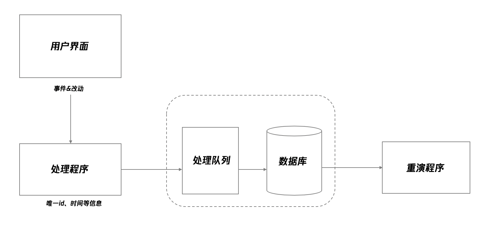

## 前端异常捕获

一般而言，一个监控系统，大致可以分为四个阶段：日志采集、日志存储、统计与分析、报告和警告

- 采集阶段：收集异常日志，先在本地做一定的处理，采取一定的方案上报到服务器
- 存储阶段：后端接收前端上报的异常日志，经过一定处理，按照一定的存储方案存储
- 分析阶段：分为机器自动分析和人工分析。机器自动分析，通过预设的条件和算法，对存储的日志信息进行统计和筛选，发现问题，触发报警。人工分析，通过提供一个可视化的数据面板，让系统用户可以看到具体的日志数据，根据信息，发现异常问题根源
- 报警阶段：分为告警和预警。告警按照一定的级别自动报警，通过设定的渠道，按照一定的触发规则进行。预警则在异常发生前，提前预判，给出警告

<!--truncate-->

## 参考

[前端异常监控解决方案研究](https://cdc.tencent.com/2018/09/13/frontend-exception-monitor-research/)

[前端错误收集以及统一异常处理](https://www.toutiao.com/i6745480016403890700/)

[谈谈前端异常捕获与上报](https://juejin.im/post/5aaa93345188257bf550cbfd#heading-7)

[React Error Boundray](https://react-1251415695.cos-website.ap-chengdu.myqcloud.com/docs/react-component.html)

[sentry](https://github.com/getsentry/sentry)

## 采集阶段

> WHO did WHAT and get WHICH exception in WHICH environment?

异常采集需要弄清楚两个事情：采集什么信息以及如何采集

对于采集信息，可以从四个方面入手：用户信息，行为信息，异常信息以及环境信息

- id 唯一标识
- project 项目文件
- userId 用户信息，可以引申出用户的权限，状态等
- path 当前路径 `document.location.origin`
- referrer 上一个路径，来源URL `document.referrer`
- event 捕获事件 自定义
- type 错误类型 自定义，数据库/组件/请求/资源引入等
- level 错误等级 自定义
- stack 错误stack信息 `errorEvent.reason.stack`
- fileName 出错文件
- lineNo 出错文件行数
- message 出错信息 `errorEvent.reason.message`
- origin 源信息，比如请求错误，存放请求路径，参数等
- userAgent 客户端描述 `window.navigator.userAgent`
- NetworkInformation 网络信息描述 `window.navigator.connection`
- appVersion 应用版本 `window.navigator.appVersion`
- current_date 发生时间 当前时间戳


### source map

注意，对于 react 项目，代码会被压缩之后再进行发布，此时捕获的错误也是压缩后的代码，这时候便出现了压缩后的代码无法找到原始报错位置的问题，如下图所示：

```
"SyntaxError: Unexpected token u in JSON at position 0
    at JSON.parse (<anonymous>)
    at _callee4$ (http://localhost:7177/static/js/main.chunk.js:5787:42)
    at tryCatch (http://localhost:7177/static/js/0.chunk.js:70819:40)
    at Generator.invoke [as _invoke] (http://localhost:7177/static/js/0.chunk.js:71045:22)
    at Generator.prototype.<computed> [as next] (http://localhost:7177/static/js/0.chunk.js:70871:21)
    at asyncGeneratorStep (http://localhost:7177/static/js/0.chunk.js:70292:24)
    at _next (http://localhost:7177/static/js/0.chunk.js:70314:9)
    at http://localhost:7177/static/js/0.chunk.js:70321:7
    at new Promise (<anonymous>)
    at http://localhost:7177/static/js/0.chunk.js:70310:12
    at http://localhost:7177/static/js/main.chunk.js:5807:24"
```

一个解决方案就是通过 Source Map 来对源文件进行追踪：

- 在 `webpack.config.js` 内改写配置 `devtool: isEnvProduction ? 'hidden-source-map' : isEnvDevelopment && 'cheap-module-source-map',`
- [source map 配置](https://webpack.docschina.org/configuration/devtool/) 查看开发和生产环境的配置


### 捕获事件

前端捕获异常分为全局捕获和单点捕获

全局捕获，优势在于代码集中，易于管理：

- 添加全局监听事件，`window.addEventListener(‘error’)`, `window.addEventListener(“unhandledrejection”)`
- 框架级别的全局监听，例如aixos中使用interceptor进行拦截，react 使用 Error Boundary
- 对全局函数进行包裹，实现在在调用该函数时自动捕获异常，一些第三库已经实现
- 重写 `console.error()` 方法，在使用方法不变的情况下也可以进行异常捕获

单点捕获，主要是针对某些特殊情况：

- `try...catch`
- 添加一个装饰器，使原函数正确运行，但是发生异常时能够捕获


## 存储阶段

对于简单的异常捕获，可以直接进行存储，但是如果要考虑接入**异常录制**的话，则需要考虑客户端缓存

### 异常录制

所谓异常录制，就是不仅仅记录发生异常的时刻，同时记录发生之前用户的记录，用来对异常现场进行有效还原

录制通过“时间”“空间”两个维度记录异常发生前到发生的整个过程，对于找到异常根源更有帮助

所谓的“异常录制”，实际上就是通过技术手段，收集用户的操作过程，对用户的每一个操作都进行记录，在发生异常时，把一定时间区间内的记录重新运行，形成影像进行播放，让调试者无需向用户询问，就能看到用户当时的操作过程


