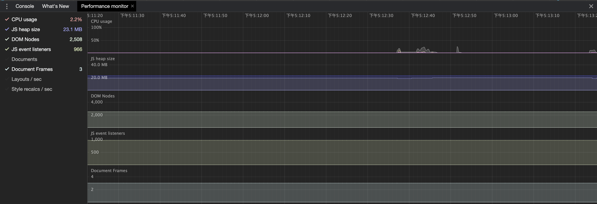
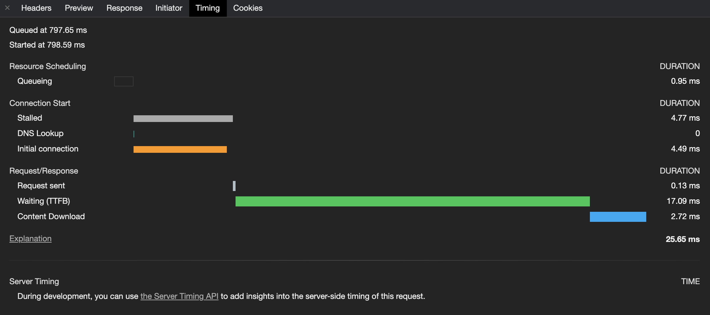
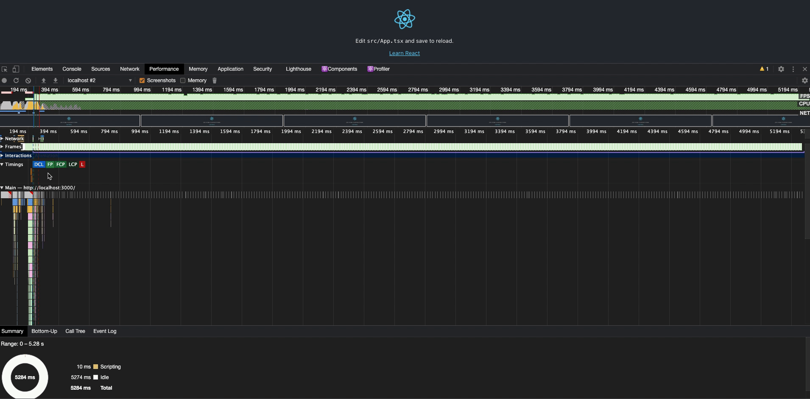
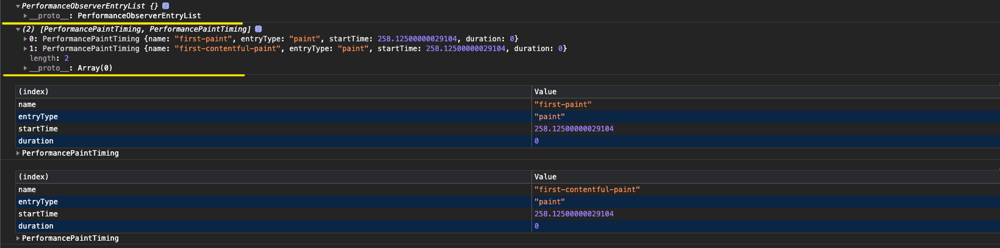
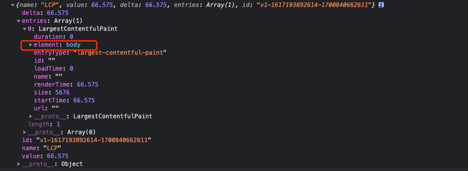

## Chrome Performance Visualization

我们先从 Chrome 控制台提供的能力开始！


### Performance Monitor

在控制台通过 `cmd + shift + p`，输入 `performance monitor` 进行调用，展示当前页面的实时指标情况



- **CPU usage:** 当前站点所用的 CPU 百分比
- **JS heap size:** 应用所占用的内存大小
- **DOM Nodes:** 内存中的 DOM 节点数
- **JS event listeners:** JavaScript 内事件监听器数量
- **Documents:** (意义不大)number of live document resources like stylesheets and scripts
- **Documents Frames:** (意义不大)the number of live frames on the page (iframes and workers)
- **Layouts / sec:** 布局重绘速率
- **Style recalcs / sec:** 样式重绘速率


### Waterfall

接着我们看看经典的 waterfall



- **Queueing:** 浏览器将资源放入队列的时间
- **Stalled:** 因放入队列而发生停滞的时间
- **DNS Lookup:** DNS 解析时间
- **Initial connection:** 建立 HTTP 请求的耗时
- **TTFB:** 等待服务器返回资源的耗时
- **Content Download:** 浏览器下载资源的时间


## Let's do it!

就让我们的探索旅程从 Chrome performance 的一个示例开始!



我们可以观察到, 在 `Timings` 维度内, Chrome 观察了五个指标, 那么我们如何通过它提供的 API 来重新造一个轮子呢?

"磨刀不误砍柴工", 我们先来学习相关的 API


### Performace Entries

`PerformanceEntry` 对象表示 performance 时间线上一系列的指标(metric), 指标的来源可以分为两部分:

- 手动构建, 通过 `mark` 或者 `measure` 来生成
- 自动生成, 在资源加载时, 会被动生成(例如图片, script 等资源加载)

执行 `window.performance.getEntries()` 来获取当前应用的所有性能指标数据, 返回值为一个对象数组, 如下所示:


通过观察结果的 `key` 值, 大致分为四种类型:

- **PerformanceNavigationTiming**
- **PerformanceResourceTiming**
- **PerformancePaintTiming**
- **PerformanceEventTiming**

上面类型的公共属性:

- `name` 表示该 performance entry 的名称, 可以是资源名称、URL 或者自定义指标名等
- `entryType` 上报指标的类型, 这个由浏览器本身来进行定义, 参考 [MDN entryType](https://developer.mozilla.org/zh-CN/docs/Web/API/PerformanceEntry/entryType)
- `startTime` 指标开始上报的时间
- `duration` 该事件发生的整体耗时

此外, 各个类型(除 PerformancePaintTiming 外)还有其他更为详细的属性信息


### PerformanceObserver

**性能监测对象** 用来监测性能度量事件(可以理解为**性能事件的 Listener** ), 当浏览器的时间线记录一个新的 `performance entries` 时进行捕获

这里需要注意 `observe()` 方法的传参问题, 具体可以参考[W3C observe](https://w3c.github.io/performance-timeline/#observe-method)

- `entryTypes` 和 `type` 只能选择其一传入, 因为 `observe()` 会根据传参的键来进行不同模式(multiple 或者 single)的处理

```javascript
// 声明一个 PerformanceObserver 示例对象, 并且注册一个回调
const ob = new PerformanceObserver((list) => {
  console.log(list) // 返回一个 `PerformanceObserverEntryList Object`
  console.log(list.getEntries()) // 通过 `getEntries()` 获取 `performance entries`
  for (const entry of list.getEntries()) {
    // `entry` is a PerformanceEntry instance.
    console.table(entry)
  }
})

// 指定监控的 `entryType` 集合, 当指定 `entryType` 的指标被捕获到时, 会触发在声明实例对象时的回调
ob.observe({ entryTypes: ['paint'] })
// 停止接受性能条目
ob.disconect()
```

让我们看看一个简单页面的针对 `paint` 类型指标的捕获内容:




## Metrics

我们已经通过一些手段获取了一堆性能数据, 接下来我们要做的事情就是对这些数据进行分类和分析.

- [核心指标解读](https://web.dev/lcp/)

**像 LCP 这类属性会随着页面内资源加载而动态改变，针对此类问题，通过 `new PerformanceObserver()` 的 `observe()` 方法进行监听，来动态获取值**


如上图，展示了浏览器加载完资源之后的主线程执行情况！

### FP(First Paint)

通常等于 FCP，衡量标准类比

`FP = Anything as visually different - Navigator`, 即浏览器开始导航到浏览器屏幕发生可视化改变的时间间隔

```typescript
const entries = window.performance.getEntries()

entries.forEach(entry => {
  if (entry.name === 'first-paint') {
    crt['fp'] = +entry.startTime.toFixed(2)
  }
})
```


### FCP(First Contentful Paint)

**衡量标准**

- Good: < 1.8s
- Needs improvemnt: 1.8s ~ 3s
- Poor: > 3s

浏览器从导航到渲染 DOM 内容的第一个字节(就是一个 DOM 元素的第一个字节)所花费的时间, 通常情况下 FP 等于 FCP

```typescript
const entries = window.performance.getEntries()

entries.forEach(entry => {
  if (entry.name === 'first-contentful-paint') {
    crt['fcp'] = +entry.startTime.toFixed(2)
  }
})
```


### TBT(Total Blocking Time)

> < 300 milliseconds means good experience

TBT 指标用于测量 FCP 到 TTI 之间，主线程被阻塞的总时长

通常存在 `Long Task` 时，主线程就被认定为“阻塞”

运行在主线程且执行耗时大于 50 毫秒的任务被认定为 `Long Task`

```typescript
let tbt = 0  
const entries = window.performance.getEntries()
// total-block-timing
entries.forEach(entry => {
  if (entry.name !== 'self' || entry.startTime < crt.fcp) return
  if (entry.duration - 50 > 0) {
    tbt += entry.duration
  }
})
```


### LCP(Largest Contentfil Paint)

> "Sometimes simpler is better. A more accurate way to measure when the main content of a page is loaded is to look at when the largest element was rendered!"
>
> ​																																														-- Google

**衡量标准**

- Good: < 2.5s
- Needs improvement: 2.5s ~ 4s
- Poor: > 4s

视窗内（视窗外的部分不计入 size，并且处于性能考虑，元素大小或位置的更改不会生成新的 LCP 候选对象）渲染时间最大的 `image or text block`, 比如 `<svg>`, `<image>`, `<video>` 等的元素。**注意，如果没有对应元素，则会返回 `<body>` **



一个更快的 LCP 能够帮助用户确认当前页面是[可用的](https://web.dev/user-centric-performance-metrics/#questions)(即是否足够的内容让用户可以进行交互)

**Load time or Render time**

对于跨域的图片资源, 如果没有设置 `Timing-Allow-Origin` 的话, 出于安全的考虑, 只会记录其 LoadTime. 因此, 如果条件允许的话, 通常建议去设置 `Timing-Allow-Origin` 的请求头

**如何捕获 LCP**

通过阅读 [web-vitals](https://github.com/GoogleChrome/web-vitals) 观察其是如何捕获 LCP 的，这里针对核心代码进行说明：

```typescript
// 1. 通过 performace observe 方法监听 largest-contentful-paint，
export const observe = (
    type: string,
    callback: PerformanceEntryHandler,
): PerformanceObserver | undefined => {
  try {
    // 验证是否支持监听该类事件
    if (PerformanceObserver.supportedEntryTypes.includes(type)) {
      const po: PerformanceObserver =
          new PerformanceObserver((l) => l.getEntries().map(callback));

      po.observe({type, buffered: true});
      return po;
    }
  } catch (e) {
    // Do nothing.
  }
  return;
};

// 2. 在页面 hidden 时或者用户产生交互事件时，捕获 entry 并进行上报，触发自定义回调
const stopListening = () => {
  // 如果定义的 metric 采集器内含有 LCP 指标，则将其记录加入到 finalMetrics 内，之后调用自定义函数
  if (!finalMetrics.has(metric)) {
    po.takeRecords().map(entryHandler as PerformanceEntryHandler);
    po.disconnect();
    finalMetrics.add(metric);
    report();
  }
}

['keydown', 'click'].forEach((type) => {
  addEventListener(type, stopListening, {once: true, capture: true});
});

onHidden(stopListening, true);
```


### FID(First Input Delay)

**衡量标准**

- Good: < 100ms
- Needs improvement: 100ms ~ 300ms
- Poor: > 300ms

FID 用来测量用户产生第一次交互（比如点击链接、按钮或者自定义的 JavaScript 空间）到浏览器能够开始处理交互事件的时间间隔

开发者往往会认定自己的代码能够被立即执行，但是用户经常会被一些延迟问题困扰，比如点击了之后没有反应。造成这种问题的原因就是，浏览器的主线程在执行其他任务（Long Task），没法执行任何 event listeners。一个常见的场景就是，浏览器忙于加载、解析和执行一个很大的 JavaScript 文件！

如上图所示，第一次输入延迟通常发生在 FCP 到 TTI 之间，在这段时间内，页面已经渲染了一些内容，但是其交互不一定完全可靠。


### CLS(Cumulative Layout Shift)

**衡量标准**

- Good: < 0.1
- Needs improvement: 0.1 ~ 0.25
- Poor: > 0.25

CLS 会测量在页面生命周期内，所有发生布局移位元素的 layout shift score 总和，这个指标用来测量可视内容的稳定性。

页面内容意外移动，通常是因为脚本文件异步加载或者 DOM 元素被动态添加到页面已有内容上，或者你引入了第三方组件造成了一些全局影响。更为严重的是，在生产环境和开发环境内，往往有不同的表现，在开发环境下，内容通常已经被缓存了，并且脚本的加载几乎是同步完成的，但是在线上这些问题会被放大。

理论上，当一个元素的位置发生变化时，它就发生了布局偏移


### DeviceMemory

通过 [navigator.deviceMemory](https://github.com/w3c/device-memory) 我们可以观察硬件的 RAM 信息

通常一个服务请求或者事件处理在不同内存设备下的表现会出现差异，Chrome telemetry 表明在低内存的设备 tab 上发生了大量的 OOM 崩溃。因此，我们需要收集该指标来作为分析的维度，也能够为我们提供 “lite” 版本的服务提供依据

其值为 GiB 中 RAM 数量的近似值

**The client hint header and API will only be available on HTTPS secure connections.**