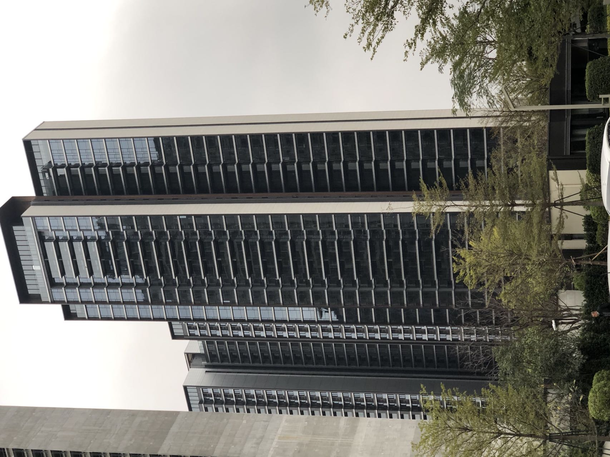
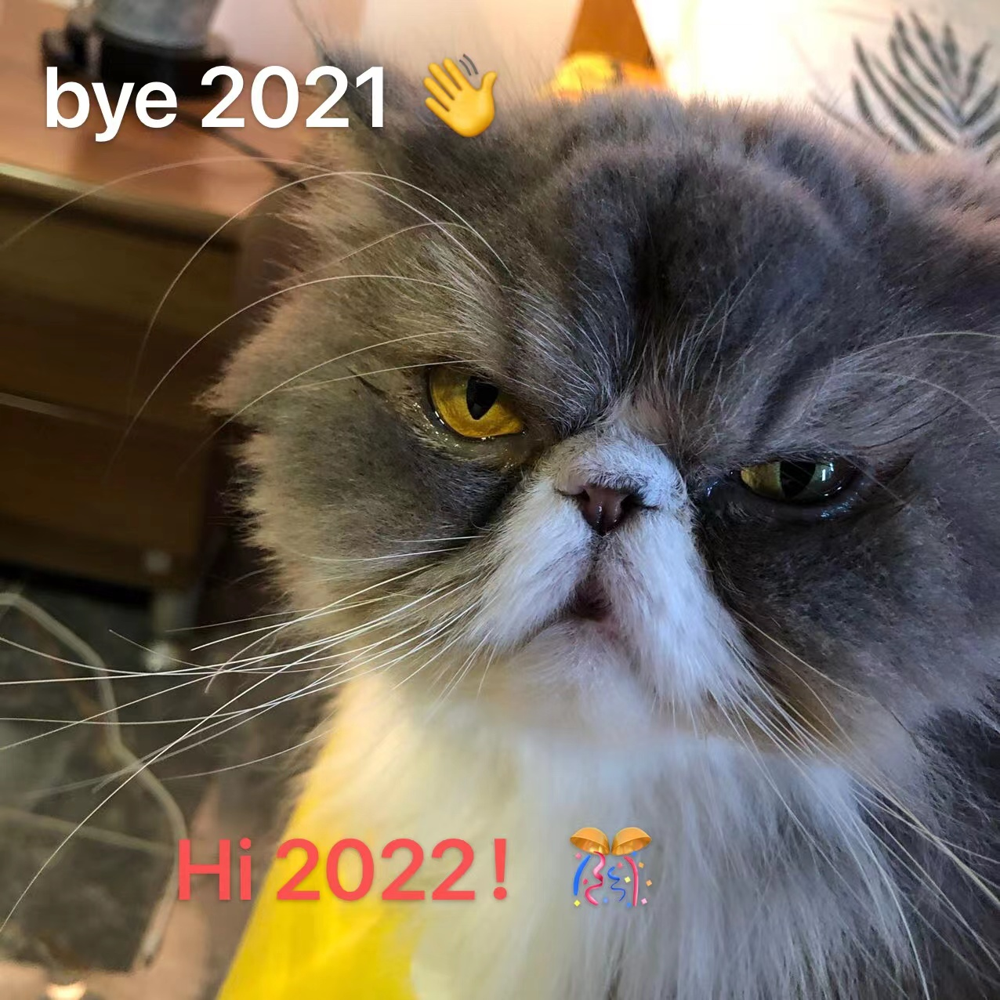

1. 回顾 2021 在自己身上发生的事情，深入思考但是不要展开，重点描述技术上的总结，不要涉及公司
2. 展望 2022

回顾整个 2021，无论是工作还是生活都取得了阶段性的进展。在这一年，我经历了组织架构上的变化，使我“复得返自然”，但是从看房到最终买房，又让我“重返另一个樊笼”。

<!--truncate-->

## 生活二三事

先从生活的二三事开始聊起吧。

3月18日，又一位至亲去世，抽了一辈子烟，喝了大半辈子的酒，终于肺癌，检查出来已是晚期。酒不喝了，但烟还不能戒，最病床上通过视频看到两个孙子呱呱坠地后，猝然离去。两个小宝贝还未睁开眼睛看一眼这个世界，另一双眼睛就随着那一口气的吐出而永远闭上了。

接着，买房贯穿了整个 2021 年。

在2021三月份后开始看房，那时候整个市场异常火热，土拍等各种政策的出炉，各地“地王”项目的面市，整个市场充斥着两种声音，“还会降”和“再不买就迟了”。不管你是哪种说法的簇拥者，在某个时间节点，都是对的。对于广州楼市而言，2021上半年和下半年是“火冰两重天”。三月份佛山陈村地王出炉的下午，哥哥立马给我打了个电话让我立即看房，因为那块地的均价已经超过了周边二手房的价格（确实迷幻）。所以，在这种时机下，我一头扎进了深不见底的广州楼市，去寻找心仪的房子。

我从大火的南沙横沥开始看起，后来5.1又和小刘去黄埔看了中鼎、中央城和时代天镜，后面周末去哥哥家玩时，恰逢佛山碧桂园三龙汇做活动，后面沉寂一段时间后，重新看了老黄埔，并做出了最终选择。

|项目|区域|琶洲|时代汉溪|均价(万)|备注|
|:-|:-:|:-:|:-:|:-:|:-:|
|美的-江上云启|南山|51min-52km|53min-42km|4.2|当时必须要全款或者低楼层，限价之后再也没有超过3.6|
|合生中央城|黄埔|26min-22km|39min-35km|3.6-4.2|当时未达到预售要求，需要去现场先到先得，限价之后房源更好更多了|
|中鼎君和名城|老黄埔|-|-|5.5|当时超预算了，并且户型和产品设计实在不敢恭维，对面的旧改大饼也不知道啥时候实现，限价之后有“总经理特批房源”，但是价格依然坚挺|
|时代天境|黄埔|26min-29km|35min-38km|4.2|小盘，配套差点，交通不便，有将军墓，特别槽点是进门左手就是厕所的户型设计，限价之后听说双合同玩的飞起|
|碧桂园三龙汇|佛山陈村|40min-31km|21min-14km|3.5|产品都还行，缺点是城市硬件和行政区域，差点上车，限价之后对面楼盘降到2.3|
|万科城市之光|老黄埔|-|-|5.5|曲折的过程，最终的选择。限价之后，一分不降，还需要抢...|

整个看房时间线简述：

- 4.21 在南沙横沥 美的江上云启认筹了5万，和小刘决定“太累了，直接上了”。后面在排队进行核酸疫苗接种时收到中介电话，说必须要全款，或者选择低楼层的，当时”艰难地“决定退筹。

- 5.2 和小刘去黄埔看几个火热的盘，当时价格也去到 4.2-5.2 左右，没有认筹，将这些资料收集起来，计算距离、价格和交通等等因素，这个时候已经隐隐有了点意识

- 5.4 去哥哥家，后面去看了佛山三龙汇的盘，当时销售说做活动，有一个 97 折的优惠，但是必须假期期间做决定，当时直接认筹了10万，当时和小刘商量觉得“楼下就是万达的感觉很棒，学位不太需要”，后面我无意中听到嫂子说他们同事买的番禺老破小。这样简单的一句给了我极大的冲击，所以后来我做出了销售极为不解的决定--”退筹“，后面又纠缠了很久，最终还是成功退筹了，我记得在办户口回来的公交车上，销售跟我说”我不希望你后悔“。**在市场大火的时候，我们更加需要保持冷静，情绪化往往会产生坏的结果，销售的终极就是情绪！**事实证明，我的选择是对的，在5.1号算下来的均价是 3.5 左右，但是短短几个月之后，已经降到 2.3-2.5 左右。

- 在三龙汇上，确实耗费了大量的精力，导致后面很长一段时间我沉寂下来，调整自己的生活状态。在这段时间碰巧知道同组同事也在看房，并且他看了大量的公众号的推文，对于买房这件事情有比较清晰地思路，而在这段时间，我也在反思自己的买房出发点和思路，一番交流下来，我们一拍即合，也正是在这时，我们重启了看房之路。而这次，路顺了很多。我们首先将目标锁定在老黄埔的网红盘，首先排除了中鼎，纯粹不喜欢他的户型设计和周边环境，我们将目标锁定在万科城市之光。

- 11.27 万科开启了 E1238 栋的线上选房，当时也是自己有点飘了，E8-2605没抢到就不再考虑其他了，觉得在当时的市场环境下，万科要么降价要么出一些好货，结果没想到万科这么能打！

- 12月初。花城要开盘，我在最后认筹了花城，因为旁边同事就是买的花城，听到他各种安利，花城要求必须三日内给齐首付，这确实是一个很严苛的要求，并且不做退步。因此我不得不提前准备，一方面打电话通知，一方面割肉股票基金（2021年，股票确实亏了）。但最后，因为小刘说“在花城，一个人回家会怕”而决定不考虑了

- 山穷水复疑无路，柳暗花明又一村。没想到，城光在上次开盘两周之后再次开盘，这次我吸取上次的教训，一方面让朋友用5G的网（手机等小刘给我换）帮我抢，一方面调整策略，选择从不那么抢手的楼层17切入。千算万算，算漏了人心，没曾想跟我们一起抢的都是上一次没抢到的选手，因此大家的心态都一样，不那么翘的楼层反而竞争更大，也因此因祸得福，我们抢到了李嘉诚住的楼层（没错，就是24，致敬科比！）。并且相较上一次，我对预算进行了更加充分的演算，选择了更大的户型，也是小刘最喜欢的南北通透的户型，喜欢阳光~

突然有一种“只要最终结果是你，过程再曲折都没关系”，现在想来还是一阵阵后怕。这件事情给我的反思就是，**思考并且立即行动，想通再做决定！**

在年底还是经历了一个闹心事，房东的亲戚生病后需要征用我正在住的房子，所以我被温柔的请了出去，还好，立即在楼上找到了新房，但是搬家实在是太累了，最后腰都快搬废，还是在约定的日期给房东把房间收拾出来了，这个过程没有任何摩擦，也算是行一善。不过这件事情让我意识到，租房确实少了一份安全感！

买房对于国人来说，是一生的大件事，确实值得我时刻反思，每次都在“悬崖边”上徘徊，还好出于各种原因没有tiu下去。后面的生活大件事不会少，如何思考如何处理，需要实践出来的智慧。

## 工作也是一种解药

2021给我最深刻的感受就是，工作是繁碌生活的解药。

在 2020 经历ld得各种许诺和让人费解的操作之后，我一度对职场产生了负面的想法。ld一边在每次周会给组员控诉某为的种种经历，同时自己又在如他口中所诉行动，从受虐者到施暴者，仅仅只是角色的变化。这也导致了在 2021 年初，整个团队处于“游离状态”，此时，急需一场变革来打破这种死气沉沉的局面。

幸好，管理层在年初迅速进行了一次组织架构调整，将之前的组归为同级组管辖，同时让ld去做边缘职务，聪明的他也选择了迅速跑路，即使他才来一年，令人唏嘘。

在加入新的团队之后，一扫之前的阴霾，我提炼和主导了可信赖前端工程。在2021年，完成了采集-上报-分析-展示的全链路开发，尤其是在采集端和上报服务内，针对不同的上报场景进行定制兼容。这项工作的成功开展，既让我收获了一个好的绩效，同时也让我成功晋升。再接再厉哟！

不同于技术产出的顺风顺水，业务对接上总会出一些小摩擦，归根结底，还是 ld 遗留下来的“烂摊子”。幸好，我在下半年新对接的业务方对我的工作有成熟的理解和支持，这让我在新的项目内如鱼得水，能够充分展示自己的才华，也的确不负所望，我们的项目受到了领导层的一致好评，同时也帮助一位同事成功转正，并留下一个不错的印象。也正是在这一年，我对业务方的需求和意见有了不一样的想法，我会认真去倾听和揣摩他们的真实意图，将其归纳成为问题，并针对问题思考更为通用的解决方案，即**用户在帮助你改善产品体验**。得益于这种顿悟，我在处理职场的“人情世故”更加得心应手。

也正是这些业务经历，使我开始关注项目的“亮点”，也让我意识到以前离代码太近了，离业务太远了，这一年也我思想觉醒的一年。

对于工作，存在职场内一直需要思考的问题。即如何将自己打造成一个靠谱的人?

现在我认为工作上的靠谱，不仅体现在对待事情的态度上，同时也和技术能力息息相关，并且我认为这两者是相得益彰的。我去年对于技术水平的沉淀需要加强，重点在所负责事情的深度思考和服务端开发的全方位了解，尤其是对于服务，需要通过技术指标和手段来反复确认其稳定性和可靠性，这一点亟需在 2022 年进行改善。并且我认为你一旦成为“靠谱的人”，工作上的烦恼会减少 90% 以上。

**情绪是个人成长的最好见证。**

## 回顾2021

回顾整个2021，许多人生的重要时刻都在这一年发生。疫情让我和小刘从异地恋升级成了异国恋，再坚持一段时间，希望最后能够开花结果。看房、搬家让人苦不堪言，曾一度怀疑“为什么要买房”，但是还好每到临界点时，都能够从工作中收货一份安宁，工作不知不觉成为了我的“解压剂”。还好，无论是房子还是工作在2021都有不错的结果，接下来，小房奴要考虑人生的下一个阶段的问题。

“如果有问题呢？”

“那就去解决问题！”

